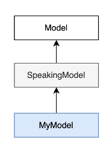
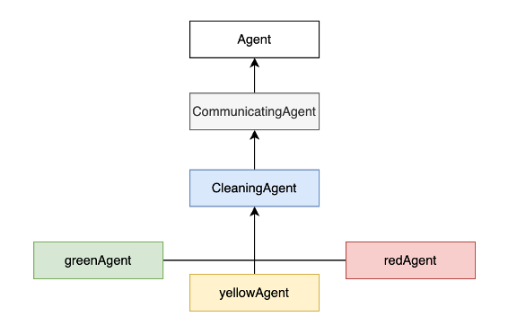
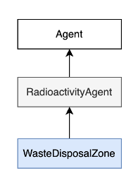
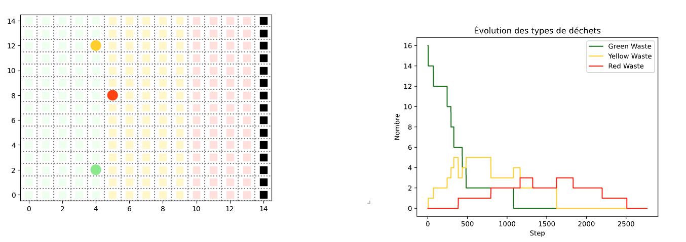
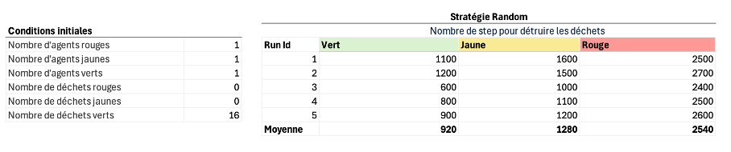
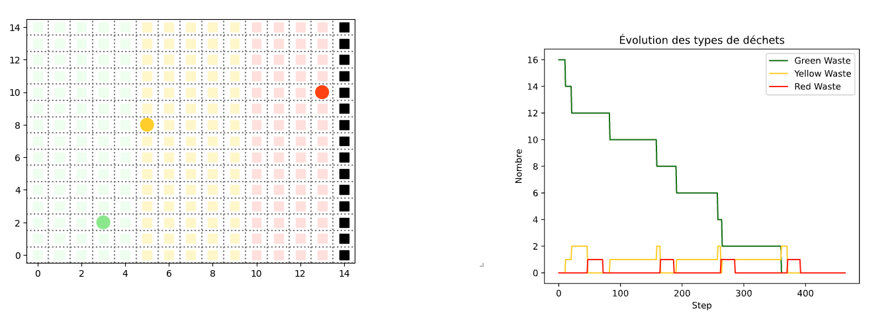
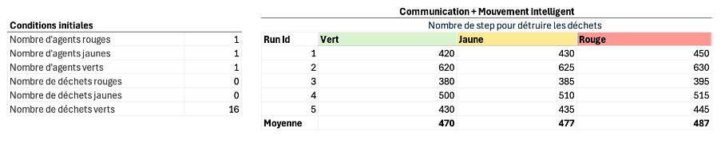
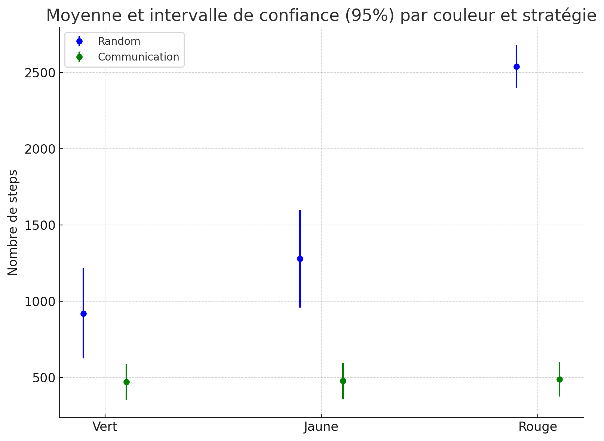

# 🤖 Robot Mission 16 – Agent-Based Simulation in a Hostile Environment

Ce projet simule une mission de robots dans un environnement radioactif, chargés de collecter, transformer et transporter des déchets vers une zone sécurisée. Il repose sur une approche **multi-agents (ABM)** utilisant la librairie **Mesa** et la visualisation **Solara**.

---

## 📁 Structure du projet

### `model.py`
Définit la classe **MyModel** qui hérite de **SpeakingModel** (elle-même héritant de **mesa.Model** avec gestion des messages).

Responsabilités :
- **Initialisation** : Positionne les robots, les déchets, les zones radioactives et la waste disposal zone sur une grille mesa.MultiGrid.
- **Gestion des actions** : Méthode do() qui exécute les actions des agents (mouvements, ramassages, dépôts, transformations).
- **Collecte des données** : Utilise DataCollector pour suivre l’évolution des déchets.



### `agents.py`
Définit les trois classes de robots :
- greenAgent
- yellowAgent
- redAgent

Chaque agent hérite de **CleaningAgent**, qui hérite de **CommunicatingAgent**.
Comportements clés (par cycle) :

	1.	Percevoir : Les agents détectent leurs voisins (robots, déchets, zones radioactives).
	2.	Délibérer : En fonction de leur position, de leur charge et de leurs messages reçus, ils choisissent une action.
	3.	Agir : Exécutent l’action via le modèle (mouvement, ramassage, fusion, dépôt).

Les agents peuvent communiquer (messages entre robots), pour annoncer les cases de dépôts comme cases target pour les robots de la couleur suivante.



### `objects.py`
Définit les agents statiques de l’environnement :
- **RadioactivityAgent** : Marque une cellule de la grille avec un niveau de radioactivité en fonction de la zone (z1, z2, z3).
- **WasteDisposalZone** : Spécialisation de RadioactivityAgent avec une radioactivité de -1 pour marquer la zone de dépôt final.
- **Waste** : Déchets (verts, jaunes, rouges).



### `server.py`
Configure la visualisation interactive avec `SolaraViz` :
- **Carte de l’environnement** : Affichage des agents mobiles (ronds), des déchets (triangles) et des zones radioactives (carrés).
- **Courbe temporelle** : Évolution du nombre de déchets par type.

Paramètres ajustables via l’interface :
- **Nombre d’agents** (verts, jaunes, rouges).
- **Quantité de déchets** (verts, jaunes, rouges).
- **Taille** de la grille.

### `run.py`
Fichier de lancement prévu pour exécuter la simulation en ligne de commande.

---

## ▶️ Lancer l'interface
Lancer le fichier run.py, ou directement via le terminal: 
```bash
solara run server.py
```

--- 

## Stratégies
### 1. Random
#### `Hypothèses`
- Les agents ne communiquent pas.
- Leur déplacement est random (en respectant leur zone et en évitant les autres agents mobiles)
- S'ils tombent par hasard sur un déchet, ils le ramassent ou le fusionne. 
- S'ils tombent par hasard sur la frontière avec un déchet cohérent à leur disposition, ils le posent.

#### `Résultats`




La méthode `random` dans ces conditions d'expérience requiert *~2500 steps* pour nettoyer l'ensemble des déchets. On remarque notamment une perte de temps significative des agents rouges car ils peuvent se déplacer sur l'ensemble du tableau de manière random.

### 2. Communication + Déplacement Intelligent
#### `Hypothèses`
- Les agents verts envoient les coordonées du déchet jaune qu'il viennent de poser aux agents jaunes. Ces derniers adaptent leur target qui devient cette cellule et se déplacent vers celle-ci.
- Les agents jaunes envoient les coordonées du déchet rouge qu'il viennent de poser aux agents rouges. Ces derniers adaptent leur target qui devient cette cellule et se déplacent vers celle-ci.
- En possession du bon déchet, les agents se déplacent vers leur frontière et déposent le déchet sur le premier espace libre.  

#### `Résultats`




La méthode `Communication + Mouvement Intelligent` dans ces conditions d'expérience requiert *~500 steps* pour nettoyer l'ensemble des déchets. On remarque que nettoyage des différentes couleurs de déchet se fait de manière beaucoup plus rapprochée et uniforme grâce à la communication. 

Le graphique ci-dessous illustre les gains statistiquement significatifs:

